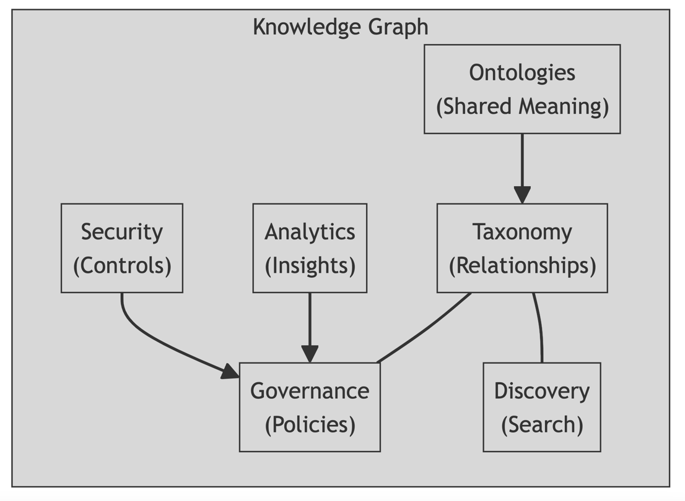
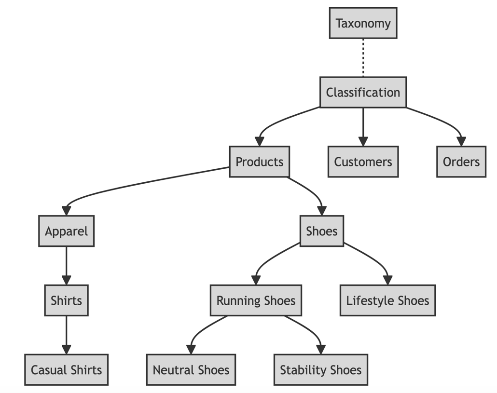
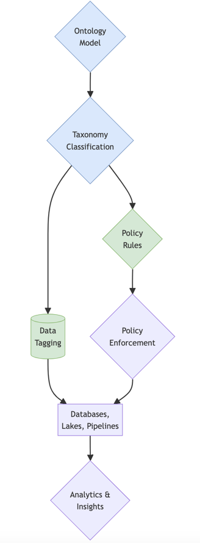
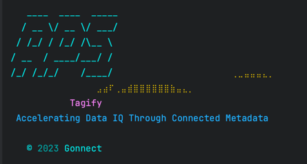

# Tagify: Unleashing the Power of Ontology-Driven Data Tagging

## Build Statues

**Tired of data silos, inconsistent metadata, and endless search for insights?**

Tagify revolutionizes data management, unlocking unprecedented value through a groundbreaking approach: ontology-driven tagging.

Imagine a world where:

* Data assets speak a common language, effortlessly understood across systems.
* Governance policies automate themselves, ensuring compliance and security.
* Insights surface effortlessly, accelerating innovation and decision-making.
* Tagify makes this a reality.

Here's how it works:

1. **A Unified Ontology:**

Concepts and relationships within your domain are meticulously modeled in RDF, a globally recognized knowledge representation standard.
This creates a shared semantic foundation, ensuring consistency and interoperability.

2. **A Powerful Taxonomy:**

A hierarchical classification system emerges from the ontology, enabling granular organization of assets.
Tags become precise and meaningful, not merely arbitrary labels.

3. **Smart Tagging APIs:**

Intuitive REST APIs empower seamless integration with data platforms like Databricks, Snowflake, and Hive.
Assets are tagged directly within your preferred environments, effortlessly weaving metadata into the fabric of your data ecosystem.

5. **Integration Symphony:**

Tagify seamlessly connects with policy catalogs and enforcement mechanisms.
Governance actions are triggered automatically based on tags, ensuring compliance and risk mitigation.

**_Experience the Benefits:_**

* Unified Metadata: Break down silos and create a cohesive knowledge graph.
* Enhanced Governance: Automate compliance, streamline access control, and streamline regulatory adherence.
* Accelerated Analytics: Discover insights faster and drive informed decision-making.
* Frictionless Adoption: Integrates seamlessly with leading data platforms.
* Robust Foundation: Built on industry-standard RDF and Spring Boot, ensuring reliability and scalability.
* Ready to transform your data landscape?

Dive into the Contents for technical details and embark on your semantic journey today!

## Contents
1.  [Introduction](introduction.md)
2.  [Value Proposition](value_proposition.md)
3.  [Overview](overview.md)
4.  [Taxonomy Foundation](taxonomy_foundation.md)
5.  [Tagging & Taxonomy](tagging_taxonomy.md)
6.  [Standards & Guidelines - RDF & Tagging](standard_guidelines.md)
7.  [Taxonomy via APis](taxonomy_apis.md)
8.  [Integration with Data Platforms & Architecture](integrations.md)
9.  [Metadata Management](mdm.md)
10. [Technology used & how to run](tech.md)
11. [Contact](contact.md)

Let's go Tagify .....

