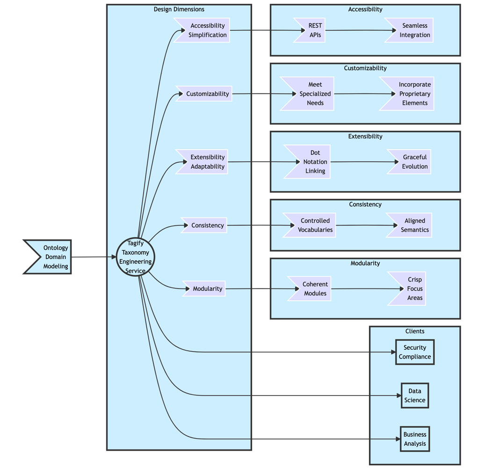
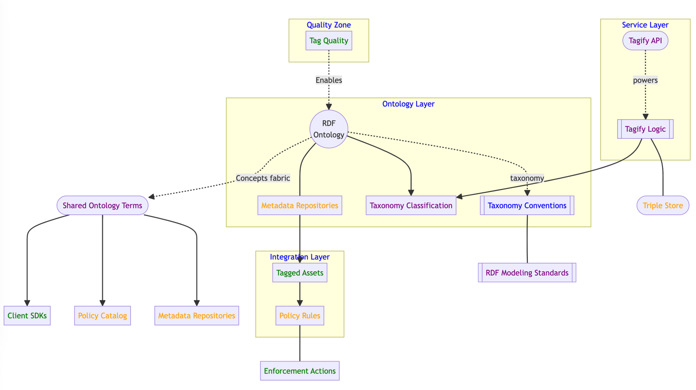

# Tagify - Ontology-driven Data Tagging

[](https://dl.circleci.com/status-badge/redirect/gh/mgorav/Tagify/tree/main)

[](https://circleci.com/gh/mgorav/Tagify/tree/main
)

Tagify leverages a formal ontology to classify data assets and expose tags through a robust API.The Tagify taxonomy engineering service purposefully traverses key dimensions to bridge ontology and organization:

**Modularity** → Methodically compose coherent modules with crisp focus areas to organize knowledge into intuitive bundles. This prevents fragmentation by grouping related concepts.

**Consistency** → Aligning vocabulary and semantics is woven across modules so taxonomy consumers have clarity, not chaos. Controlled vocabularies become second nature.

**Extensibility** → Future-proof taxonomies, ensuring ontologies can evolve without brittleness. Dot notation provides durable links that gracefully adapt domains.

**Customizability** → Taxonomies aren’t one-size-fits all. We collaborate with customers to incorporate proprietary elements that meet specialized needs.

**Accessibility** → Dot notation taxonomy conventions remove complexity barriers.

REST APIs encourage programmatic integration into existing flows.

The outcome is a scalable medium exchanging meaning across teams and tools tackling data challenges – from security to compliance to analytics and more!



## Overview

An ontology formally defines the concepts, entities, relationships and properties within a domain. It provides a shared conceptual model of the knowledge in that domain.

For example, an ontology could model:

- Products
- Customers
- Orders
- Inventory

And relationships like:

- Customer "places" Order
- Order "includes" Product

A taxonomy categorizes entities into hierarchical classifications, often derived from the ontology relationships.

For example, the product taxonomy could be:

- Product
    - Electronics
        - Computers
            - Laptops
            - Desktops
        - Phones
            - Smartphones
    - Home
        - Furniture
        - Appliances

## Key Benefits

Using an ontology and taxonomy provides benefits like:

- Standard terminology for interoperability
- Reasoning to derive new knowledge
- Classification for governance and analysis

## Tagging for Governance

For data governance, tags can be derived from the ontology and taxonomy to classify data assets like:

```
acme.customer.PII -> Labels customer PII data
acme.product.inventory -> Tags product inventory datasets 
```

## Conceptual Overview

An ontology defines concepts and relationships to model a domain. Tagify uses this ontology to tag assets like databases and APIs using the dot notation taxonomy:

```
[Namespace].[Category].[Classification]
```

For example, `acme.inventory.SupplierTable` attaches a classification tag. The taxonomy is derived from ontology relationships.

## Taxonomy Foundations

The taxonomy leverages mathematical classification techniques grounded in formal concept analysis (FCA), a branch of lattice theory centering set-theoretic structures.

FCA relies on the fundamental notion of a formal context defined over objects and attributes. This context forms a mathematical lattice conveying conceptual hierarchies.

The ontology taxonomy aligns to this formal context structure, enabling set membership checks for classification. For an object `x` and concept `C`, this lattice membership is formalized as:

```
x ∈ C ⟺ {a ∈ A | (x,a) ∈ R} = C′ 
```

Where `A` is the set of attributes, `R` is a relation between objects `X` and attributes `A`, and `C'` is the prime operator deriving intent from extent.

This means an object `x` belongs to a concept `C` if its attributes match the prime derivation of `C` based on relational mappings.

The taxonomy applies this principle to categorize entities through hierarchical concepts indexed by coordinated attributes. The ontology provides the contextual foundation through its embedded relational graph.
```
Let X = {Apple, Orange, Table, Chair} be product items
Let A = {Fruit, Furniture, Sweet, Citrus} be product attributes

Define relation R ⊆ X × A as:

R = { (Apple, Fruit), (Apple, Sweet),
(Orange, Fruit), (Orange, Citrus),  
(Table, Furniture),
(Chair, Furniture) }

This forms the formal context K = (X, A, R)

Now consider concept C = Fruit
Its prime operator derivation is:
C' = {a ∈ A | for all x ∈ X, if (x, a) ∈ R, then x ∈ C}
= {Fruit}

Then Apple ∈ Fruit since:
{a ∈ A | (Apple, a) ∈ R} = {Fruit, Sweet} = C'

Similarly, Orange ∈ Fruit using the same lattice membership logic.
```

### Comparing Classification and Categorization

Classification and categorization offer complementary approaches for organizing elements which can be compared across several key dimensions:

Feature | Classification | Categorization
-|-|-
Defining Property | Necessary and sufficient conditions for membership | Family resemblances centered on prototypes
Mathematical Formalization | Rigid set membership based on feature possession m ∈ C ⟺ D(C) ⊆ M | Graded membership based on typicality ratings T(m,C) → [0,1]
Architectural Instantiation | Hierarchical taxonomies with superordinate and subordinate classes | Flexible conceptual clusterings responsive to contexts
Examples | Nike product database organized by attributes like sport, use case, gender, etc. | Nike shoes grouped into running, training, lifestyle based on style cues 
Key Advantages | Supports robust knowledge encoding and inferences via inheritance relationships | Adaptable to interdisciplinary content and innovative cases
Key Disadvantages | Brittleness to atypical instances and aerial views | Lacks persistent systematicity hindering transmission

In short, classification relies on rigid, formal conditions for set membership in hierarchical structures enabling inference. In contrast, categorization uses flexible typicality-based clustering sensitive to real-world contexts and new content.

Hybrid approaches can integrate these mechanisms to balance tradeoffs. The organizing principles match use case goals - classification for inference-based reasoning leveraging knowledge bases, categorization for pragmatic similarity judgments adjusting to new observations.

## RDF Ontology Drivers

RDF provides a robust framework for knowledge representation leveraging discrete semantic triples and graph models. This shapes an adaptable substrate for structuring rich ontologies amenable to multi-faceted taxonomy derivation.

Core RDF components include:

**Statements** - Captured in (subject, predicate, object) triples describing resources. For example:

```
acme:CustomerProfile a rdf:Class .
```  

**Vocabularies** - Use namespace prefixes to qualify terms. Example:

```
acme:VIPCustomer rdf:type acme:CustomerProfile .
```

**Ontologies** - Build conceptual models comprising entities, relationships, properties within a domain of interest.

**Taxonomies** - Hierarchical classification structures based on ontology semantics. For example:

```
acme:CustomerProfile
  acme:BasicProfile
  acme:VIPProfile
```

RDF ontologies and taxonomies are powered by shared referenceable URIs allowing integration across contexts. Descriptive triples flexibly relate resources without requiring rigid schemas.

**Query** - SPARQL protocol enables complex graph query patterns across taxonomy dimensions:

```
SELECT ?custProfile WHERE {
  ?custProfile rdf:type acme:CustomerProfile .
}
```

This returns all customer profile subclasses in the ontology. The underlying RDF graphs interlink taxonomy concepts through rich semantic relationships.

In total, RDF delivers the building blocks for an extensible, modular enterprise ontology amenable to interleaving hierarchical and relational views - perfect for multi-axis taxonomy development tightly coupled with underlying domain models.

## SPARQL Powers Taxonomy Queries

SPARQL is the standard RDF graph query language, providing robust capabilities to search and traverse ontology taxonomies.

SPARQL queries match **triple patterns** made up of:

- **Subject** - Resource being described
- **Predicate** - Relationship, property of subject
- **Object** - Target resource or literal value

For example:

```
acme:Customer  acme:hasProfile  acme:PremiumProfile

Subject        Predicate          Object
```

Common predicates include:

- **rdfs:subClassOf** - Taxonomy hierarchies
- **rdf:type** - Class membership
- **owl:sameAs** - Equivalence

**Triple patterns** are used in SPARQL templates with **variables** denoted by ? or $ symbols:

```
?customer acme:hasProfile ?profile .
```

When executed, these **query templates** match against the RDF dataset graph to bind variables to resources.

**Solutions** are result sets with variable **bindings**:

```
-------------------------------
| customer      | profile     |        
============================= |
| :Alice        | acme:Gold   |
| :Bob          | acme:Silve  |
------------------------------
```

In this way, SPARQL provides all the necessary vocabulary to construct, evaluate, and derive answers over ontology and taxonomy knowledge models encoded in RDF.

The semantic graph structure creates a web of relationships flexibly queried using SPARQL's powerful graph pattern matching capabilities.


Key SPARQL fundamentals:

**Basic Patterns** - Match graph patterns in queries:

```
?customer rdf:type acme:VIPCustomer .
``` 

**Prefixes** - Qualify vocabulary terms:

``` 
PREFIX acme: <http://acme.com/ns#>
```

**Variable Binding** - Assign results:

```
?profile = acme:PlatinumProfile
```

**Property Paths** - Travers relationships:

``` 
acme:Customer acme:hasProfile+ ?profile .
``` 

**Results** - Table, JSON, Graph formats:

```
-----------------------------
| profile                 |
============================
| acme:GoldProfile        |
| acme:PlatinumProfile    |
-----------------------------
```

**Federation** - Distribute queries across graphs.

**Inferencing** - Apply rules to derive facts.

**Analytics** - Aggregations, slices, dices across taxonomy dimensions.

For example, drilling down profiles by state:

```sql
SELECT ?state (count(?profile) as ?count)
WHERE {
  ?customer acme:isLocatedIn ?state .
  ?customer acme:hasProfile ?profile
}
GROUP BY ?state  
```

In total, SPARQL unlocks sophisticated ontology-based taxonomy analysis to power next-generation metadata intelligence.


## Technical Details

The ontology is modeled in W3C standard RDF (Resource Description Framework):

```
acme:Semantics a rdf:Class .
acme:Confidential a rdf:Class;
                 rdf:type acme:Access.
```

## Unified Tagging Taxonomy

The tag structure is:

| Tag Type      | Description            | Example               |
| ------------- | ---------------------- | --------------------- |
| **Semantics** | Defines meaning        | acme.order.Customer   |
| **Discovery** | Links assets           | acme.product.replacement |
| **Access**    | Classifies access      | acme.sales.Confidential |
| **Lifecycle** | Manages lifespan       | acme.customer.Retention |

## Direct RDF Mapping

Each tag type directly maps to its RDF class:

```
acme:Confidential rdf:type acme:Access
```

This enables consistent semantics across tools leveraging the ontology.

### OAS UI


## RDF Ontology Modeling

The ontology represents the taxonomy in RDF:

```
# Semantic Tag
acme:Semantics a rdf:Class .
acme:CustomerInfo a rdf:Class;
                  rdf:type acme:Semantics .

# Discovery Tag                 
acme:Discovery a rdf:Class .  
acme:Replacement a rdf:Class;
                  rdf:type acme:Discovery .

# Access Tag    
acme:Access a rdf:Class .
acme:Confidential a rdf:Class;
                   rdf:type acme:Access .
                   
# Lifecycle Tag
acme:DataLifecycle a rdf:Class .   
acme:Retention a rdf:Class;
                 rdf:type acme:DataLifecycle .
```

This demonstrates modeling examples of mapping the unified taxonomy types to formal RDF ontology concepts and relationships.

## Tagging APIs

The APIs follow the dot notation tagging convention:

```
GET /tags/acme.customer/semantics
```

The underlying RDF ontology models the concepts:

```
acme:Semantics a rdf:Class .
acme:CustomerInfo a rdf:Class; 
                  rdf:type acme:Semantics.
```

This enables the api to return the matching tags:

```
[
  "acme.customer.CustomerInfo"
]
```

Additional examples for other tag types:

```
# RDF Ontology
acme:Access a rdf:Class .  
acme:Public a rdf:Class;
             rdf:type acme:Access.
             
# API Call            
GET /tags/acme.data/access

# Response Tags 
[
  "acme.data.Public"
]
```

And lifecycle tags:

``` 
# RDF Ontology
acme:Retention a rdf:Class;
                rdf:type acme:DataLifecycle.
                
# API Call                  
GET /tags/acme.order/lifecycle  

# Response Tags
[
  "acme.order.Retention"  
]
```

The tagging REST APIs could enable this as:

Endpoint | Description | Example Response
--- | --- | ---
GET /tags/namespaces | Get all namespaces | ["acme"]
GET /tags/acme/semantics | Get semantic tags | ["acme.customer", "acme.product"]  
GET /tags/acme/customer | Get all customer tags | ["acme.customer.PII", "acme.customer.profile"]
GET /tags/acme/product | Get all product tags | ["acme.product.inventory", "acme.product.pricing"]


## Integrations with Data Platforms

Tagify provides seamless integration with leading data engineering platforms like Databricks, Snowflake, and Hive to enable unified data governance through consistent classification.

The taxonomy APIs classify assets and expose ontology-aligned tags:

```
GET /tags/acme.customer/semantics
```

These tags can then be applied to data objects like tables and columns:

**Databricks**

```python
# Classify customer table
CREATE TABLE customers (id INT, name STRING) TAGGED "acme.customer.PII" 

# Classify order table  
CREATE TABLE orders (order_id INT, customer_id INT) TAGGED "acme.order.TransactionData"
```

**Snowflake**

```sql 
-- Classify customer table
CREATE TABLE customers (id INT, name STRING) TAG acme.customer.PII

-- Classify order table
CREATE TABLE orders (order_id INT, customer_id INT) TAG acme.order.TransactionData 
```

**Hive**

```sql
-- Classify customer table 
CREATE TABLE customers (id INT, name STRING) TBLPROPERTIES ('acme.customer.PII'='true')

-- Classify order table 
CREATE TABLE orders (order_id INT, customer_id INT) TBLPROPERTIES ('acme.order.TransactionData'='true') 
```

This demonstrates direct application of Tagify taxonomy tags to data assets within platform native syntax. The tags become first class metadata aligning meaning across systems.

Key benefits include:

- Unified semantics for interoperability
- Consistent access controls
- Streamlined data discovery
- Automated lifecycle management

## Architecture Design

Tagify leverages a layered architecture aligned to its ontology-based classification capabilities.

The architecture consists of 3 key layers - Ontology, Service and Integration:



**Ontology Layer**

This models the core RDF Ontology which formally defines the concepts, relationships and taxonomy for the domain. Key components:

- RDF Ontology: Formal conceptual model in RDF format
- Taxonomy Classification: Organizes concepts into hierarchical taxonomies
- Metadata Repositories: Links ontology to external systems

The ontology provides the foundation for deriving standardized taxonomy tags consistently across tools.

**Service Layer**

This exposes APIs for tagging operations and handles taxonomy business logic:

- Tagify API: REST endpoints for tagging APIs aligned to taxonomy
- Tagify Logic: Business logic for retrieving ontology-based tags
- Triple Store: Manages taxonomy terms modeled in RDF graphs

The service layer leverages the ontology terms to deliver unified tagging capabilities.

**Integration Layer**

This connects the taxonomy to data assets and policy catalogs:

- Tagged Assets: Annotates datasets with classification tags
- Policy Rules: Links governance policies to specific tags
- Enforcement Actions: Executes actions like access restrictions based on tags

The integration later enables scalable governance workflows driven by shared taxonomy.

The ontology ties the components together by providing common semantics accessible via consistent RDF graphs and taxonomy structure across systems.


## Technologies Used

- Java 17
- Spring Boot 3.2.1
- Spring Web MVC
- SpringDoc OpenAPI 3.0 for documentation
- Eclipse RDF4J for RDF data management

## Running Tagify

The application is packaged as a Java Spring Boot application.

### Prerequisites

- Java 17
- Maven

### Steps

1. Clone the repository (not available in free version)
2. Navigate to the project directory (not available in free version)
3. Build using Maven: `mvn clean install` (no available in free version)
4. Run the application: `java -jar Tagify-0.0.1-in-momory.jar`
5. Access Swagger UI documentation on http://localhost:8080/swagger-ui/index.html

The application exposes REST APIs for taxonomy and tagging operations. The RDF ontology is loaded in an in-memory store on startup.

The main components are:

- `TaggingController` - REST API endpoints
- `TaggingService` - Business logic
- `TaggingRepository` - RDF4J based data access

### NOTE
For more information and to request a demo, please contact our team at gonnect.ask@gmail.com. We would be happy to schedule a call to discuss our solutions in more detail and answer any questions you may have.
