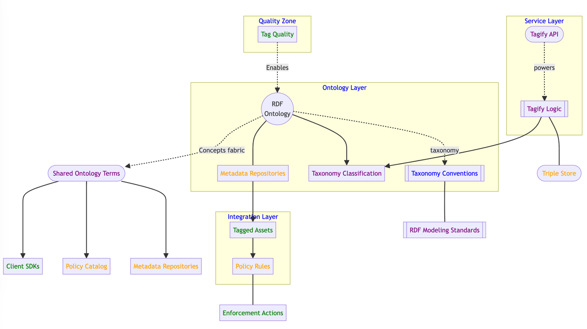

## Integrations with Data Platforms

Tagify provides seamless integration with leading data engineering platforms like Databricks, Snowflake, and Hive to enable unified data governance through consistent classification.

The taxonomy APIs classify assets and expose ontology-aligned tags:

```
GET /tags/acme.customer/semantics
```

These tags can then be applied to data objects like tables and columns:

**Databricks**

```python
# Classify customer table
CREATE TABLE customers (id INT, name STRING) TAGGED "acme.customer.PII" 

# Classify order table  
CREATE TABLE orders (order_id INT, customer_id INT) TAGGED "acme.order.TransactionData"
```

**Snowflake**

```sql 
-- Classify customer table
CREATE TABLE customers (id INT, name STRING) TAG acme.customer.PII

-- Classify order table
CREATE TABLE orders (order_id INT, customer_id INT) TAG acme.order.TransactionData 
```

**Hive**

```sql
-- Classify customer table 
CREATE TABLE customers (id INT, name STRING) TBLPROPERTIES ('acme.customer.PII'='true')

-- Classify order table 
CREATE TABLE orders (order_id INT, customer_id INT) TBLPROPERTIES ('acme.order.TransactionData'='true') 
```

This demonstrates direct application of Tagify taxonomy tags to data assets within platform native syntax. The tags become first class metadata aligning meaning across systems.

Key benefits include:

- Unified semantics for interoperability
    - Consistent access controls
    - Streamlined data discovery
    - Automated lifecycle management

## Architecture Design

Tagify leverages a layered architecture aligned to its ontology-based classification capabilities.

The architecture consists of 3 key layers - Ontology, Service and Integration:



**Ontology Layer**

This models the core RDF Ontology which formally defines the concepts, relationships and taxonomy for the domain. Key components:

- RDF Ontology: Formal conceptual model in RDF format
    - Taxonomy Classification: Organizes concepts into hierarchical taxonomies
    - Metadata Repositories: Links ontology to external systems

The ontology provides the foundation for deriving standardized taxonomy tags consistently across tools.

**Service Layer**

This exposes APIs for tagging operations and handles taxonomy business logic:

- Tagify API: REST endpoints for tagging APIs aligned to taxonomy
    - Tagify Logic: Business logic for retrieving ontology-based tags
    - Triple Store: Manages taxonomy terms modeled in RDF graphs

The service layer leverages the ontology terms to deliver unified tagging capabilities.

**Integration Layer**

This connects the taxonomy to data assets and policy catalogs:

- Tagged Assets: Annotates datasets with classification tags
    - Policy Rules: Links governance policies to specific tags
    - Enforcement Actions: Executes actions like access restrictions based on tags

The integration later enables scalable governance workflows driven by shared taxonomy.

The ontology ties the components together by providing common semantics accessible via consistent RDF graphs and taxonomy structure across systems.