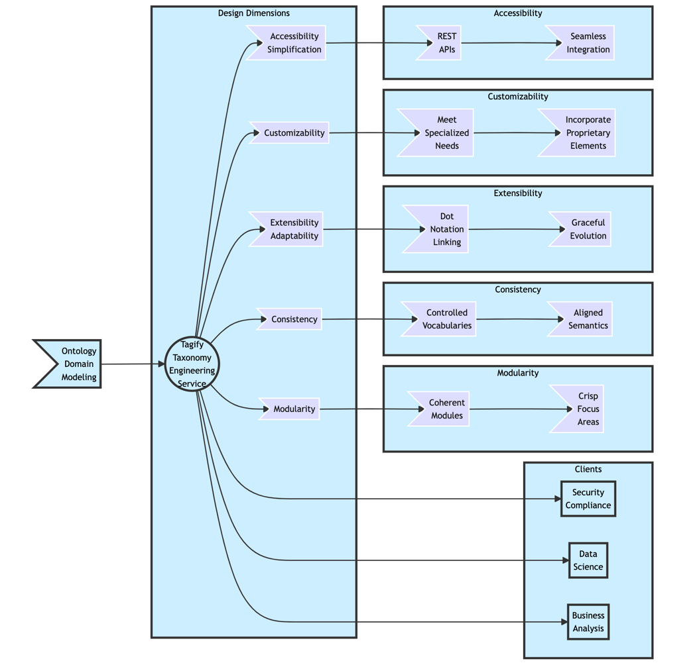

Tagify pioneers a revolutionary approach for effective data governance and precision insights. It seamlessly connects your enterprise knowledge graph with data assets through a formal ontology. This enables consistent tagging with unmatched granularity to unlock cross-functional collaboration.

**Core Benefits:**

* **_Unified Language_**: Establishes shared semantics to break down data silos across systems
* **_Compliance Automation_**: Enforces policies and regulations through integrated governance
* **_Accelerated Innovation_**: Allows instant self-service access to empower users
* **_Enriched Analytics_**: Facilitates targeted segmentation and analysis
* **_Frictionless Adoption_**: Embraces leading data platforms like Snowflake for easy integration

Architectural excellence with RDF Foundation: Constructed on the extensible industry-gold standard Resource Description Framework to future-proof taxonomies.

**SPARQL Power:** Execute sophisticated graph queries across ontology relationships for intricate insights.

**Scalability and Reliability:** Boasts a robust layered architecture built using Java 17 and Spring Boot for unmatched quality.

**Intuitive Taxonomy Design Principles:**

* **_Modularity_**: Compose coherent modules to organize knowledge into intuitive bundles
* **_Consistency_**: Align semantics across modules for clarity
* **_Extensibility_**: Enable flexible evolution without brittleness
* **_Customizability_**: Incorporate proprietary elements to meet specialized needs
* **_Accessibility_**: Simplify complexity through dot notation conventions

Unlock the Potential of Your Data:

Tagify empowers you to transform your data landscape into a knowledge powerhouse. Experience the benefits of:

* Unified metadata management
* Enhanced data discovery
* Accelerated analytics
* Streamlined governance
* Reduced compliance risks
* Increased data ROI

**_Ready to embark on your semantic journey?_**