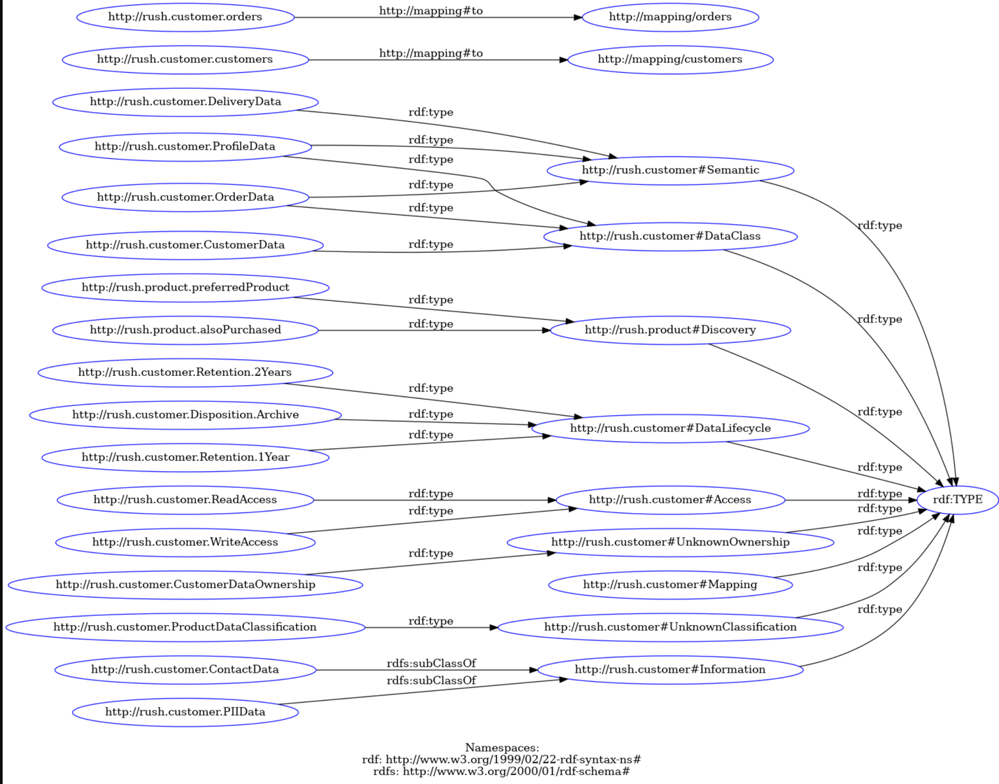

## Integration Tests:

### RDF Explanation:

The RDF (Resource Description Framework) provided here represents the tags and relationships created in the integration tests. RDF is a standardized way of describing resources on the web, using subject-predicate-object triples. In this representation:

- Tags are represented as resources with unique URIs (Uniform Resource Identifiers).
- The `rdf:TYPE` property is used to state that a resource belongs to a certain type.
- For relationships between resources, we use specific predicates (e.g., `rdfs:subClassOf`, `<http://mapping#to>`).
- Some resources are organized into classes, and sub-class relationships are defined using `rdfs:subClassOf`.


```turtle
@prefix rdf: <http://www.w3.org/1999/02/22-rdf-syntax-ns#> .
@prefix rdfs: <http://www.w3.org/2000/01/rdf-schema#> .

# Customer semantic tags
<http://rush.customer#Semantic> a rdf:TYPE .
<http://rush.customer.ProfileData> a <http://rush.customer#Semantic> .
<http://rush.customer.OrderData> a <http://rush.customer#Semantic> .
<http://rush.customer.DeliveryData> a <http://rush.customer#Semantic> .

# Product affinity tags
<http://rush.product#Discovery> a rdf:TYPE .
<http://rush.product.preferredProduct> a <http://rush.product#Discovery> .
<http://rush.product.alsoPurchased> a <http://rush.product#Discovery> .

# Customer lifecycle tags
<http://rush.customer#DataLifecycle> a rdf:TYPE .
<http://rush.customer.Retention.1Year> a <http://rush.customer#DataLifecycle> .
<http://rush.customer.Retention.2Years> a <http://rush.customer#DataLifecycle> .
<http://rush.customer.Disposition.Archive> a <http://rush.customer#DataLifecycle> .

# Access control tags
<http://rush.customer#Access> a rdf:TYPE .
<http://rush.customer.ReadAccess> a <http://rush.customer#Access> .
<http://rush.customer.WriteAccess> a <http://rush.customer#Access> .

# Unknown ownership tags
<http://rush.customer#UnknownOwnership> a rdf:TYPE .
<http://rush.customer.CustomerDataOwnership> a <http://rush.customer#UnknownOwnership> .

# Unknown classification tags
<http://rush.customer#UnknownClassification> a rdf:TYPE .
<http://rush.customer.ProductDataClassification> a <http://rush.customer#UnknownClassification> .

# Schema mapping tags
<http://rush.customer#Mapping> a rdf:TYPE .
<http://rush.customer.customers> <http://mapping#to> <http://mapping/customers> .
<http://rush.customer.orders> <http://mapping#to> <http://mapping/orders> .

# Level 2 classification tags
<http://rush.customer#DataClass> a rdf:TYPE .
<http://rush.customer.CustomerData> a <http://rush.customer#DataClass> .
<http://rush.customer.OrderData> a <http://rush.customer#DataClass> .
<http://rush.customer.ProfileData> a <http://rush.customer#DataClass> .

# Level 3 classification tags
<http://rush.customer#Information> a rdf:TYPE .
<http://rush.customer.PIIData> rdfs:subClassOf <http://rush.customer#Information> .
<http://rush.customer.ContactData> rdfs:subClassOf <http://rush.customer#Information> .
```

Store above RDF using below command:
```
curl -X 'POST' \
  'http://localhost:8080/tags/rdf?format=turtle' \
  -H 'accept: */*' \
  -H 'Content-Type: application/json' \
  -d '@prefix rdf: <http://www.w3.org/1999/02/22-rdf-syntax-ns#> .
@prefix rdfs: <http://www.w3.org/2000/01/rdf-schema#> .

# Customer semantic tags
<http://rush.customer#Semantic> a rdf:TYPE .
<http://rush.customer.ProfileData> a <http://rush.customer#Semantic> .
<http://rush.customer.OrderData> a <http://rush.customer#Semantic> .
<http://rush.customer.DeliveryData> a <http://rush.customer#Semantic> .

# Product affinity tags
<http://rush.product#Discovery> a rdf:TYPE .
<http://rush.product.preferredProduct> a <http://rush.product#Discovery> .
<http://rush.product.alsoPurchased> a <http://rush.product#Discovery> .

# Customer lifecycle tags
<http://rush.customer#DataLifecycle> a rdf:TYPE .
<http://rush.customer.Retention.1Year> a <http://rush.customer#DataLifecycle> .
<http://rush.customer.Retention.2Years> a <http://rush.customer#DataLifecycle> .
<http://rush.customer.Disposition.Archive> a <http://rush.customer#DataLifecycle> .

# Access control tags
<http://rush.customer#Access> a rdf:TYPE .
<http://rush.customer.ReadAccess> a <http://rush.customer#Access> .
<http://rush.customer.WriteAccess> a <http://rush.customer#Access> .

# Unknown ownership tags
<http://rush.customer#UnknownOwnership> a rdf:TYPE .
<http://rush.customer.CustomerDataOwnership> a <http://rush.customer#UnknownOwnership> .

# Unknown classification tags
<http://rush.customer#UnknownClassification> a rdf:TYPE .
<http://rush.customer.ProductDataClassification> a <http://rush.customer#UnknownClassification> .

# Schema mapping tags
<http://rush.customer#Mapping> a rdf:TYPE .
<http://rush.customer.customers> <http://mapping#to> <http://mapping/customers> .
<http://rush.customer.orders> <http://mapping#to> <http://mapping/orders> .

# Level 2 classification tags
<http://rush.customer#DataClass> a rdf:TYPE .
<http://rush.customer.CustomerData> a <http://rush.customer#DataClass> .
<http://rush.customer.OrderData> a <http://rush.customer#DataClass> .
<http://rush.customer.ProfileData> a <http://rush.customer#DataClass> .

# Level 3 classification tags
<http://rush.customer#Information> a rdf:TYPE .
<http://rush.customer.PIIData> rdfs:subClassOf <http://rush.customer#Information> .
<http://rush.customer.ContactData> rdfs:subClassOf <http://rush.customer#Information> .'
```

This RDF representation captures the main concepts and relationships between them based on the tags created in your integration tests. The actual RDF structure may need further refinement based on your specific ontology and use case.



This table breaks down each resource, its type, and any relationships or comments associated with it in the RDF.


| **Resource**                                       | **Type**                                    | **Relationship / Comments**                                                     |
|----------------------------------------------------|---------------------------------------------|----------------------------------------------------------------------------------|
| `<http://rush.customer#Semantic>`                  | `rdf:TYPE`                                  | Represents a semantic tag category for customer data.                            |
| `<http://rush.customer.ProfileData>`               | `<http://rush.customer#Semantic>`           | Represents a specific semantic tag for customer profile data.                     |
| `<http://rush.customer.OrderData>`                 | `<http://rush.customer#Semantic>`           | Represents a specific semantic tag for customer order data.                       |
| `<http://rush.customer.DeliveryData>`              | `<http://rush.customer#Semantic>`           | Represents a specific semantic tag for customer delivery data.                    |
| `<http://rush.product#Discovery>`                  | `rdf:TYPE`                                  | Represents a category for product affinity tags.                                  |
| `<http://rush.product.preferredProduct>`           | `<http://rush.product#Discovery>`           | Represents a specific tag indicating a preferred product.                         |
| `<http://rush.product.alsoPurchased>`             | `<http://rush.product#Discovery>`           | Represents a specific tag indicating products also purchased.                    |
| `<http://rush.customer#DataLifecycle>`            | `rdf:TYPE`                                  | Represents a category for customer data lifecycle tags.                           |
| `<http://rush.customer.Retention.1Year>`          | `<http://rush.customer#DataLifecycle>`     | Represents a specific tag indicating a 1-year data retention period.              |
| `<http://rush.customer.Retention.2Years>`         | `<http://rush.customer#DataLifecycle>`     | Represents a specific tag indicating a 2-year data retention period.              |
| `<http://rush.customer.Disposition.Archive>`      | `<http://rush.customer#DataLifecycle>`     | Represents a specific tag indicating data disposition to archive.                 |
| `<http://rush.customer#Access>`                    | `rdf:TYPE`                                  | Represents a category for access control tags.                                     |
| `<http://rush.customer.ReadAccess>`               | `<http://rush.customer#Access>`             | Represents a specific tag indicating read access.                                 |
| `<http://rush.customer.WriteAccess>`              | `<http://rush.customer#Access>`             | Represents a specific tag indicating write access.                                |
| `<http://rush.customer#UnknownOwnership>`         | `rdf:TYPE`                                  | Represents a category for unknown ownership tags.                                  |
| `<http://rush.customer.CustomerDataOwnership>`    | `<http://rush.customer#UnknownOwnership>`  | Represents a specific tag indicating ownership of customer data is unknown.       |
| `<http://rush.customer#UnknownClassification>`    | `rdf:TYPE`                                  | Represents a category for unknown classification tags.                            |
| `<http://rush.customer.ProductDataClassification>`| `<http://rush.customer#UnknownClassification>`| Represents a specific tag indicating unknown classification of product data.      |
| `<http://rush.customer#Mapping>`                   | `rdf:TYPE`                                  | Represents a category for schema mapping tags.                                     |
| `<http://rush.customer.customers>`                 | `<http://mapping#to>`                       | Represents a mapping from `customers` to `<http://mapping/customers>`.             |
| `<http://rush.customer.orders>`                    | `<http://mapping#to>`                       | Represents a mapping from `orders` to `<http://mapping/orders>`.                   |
| `<http://rush.customer#DataClass>`                | `rdf:TYPE`                                  | Represents a category for level 2 classification tags.                            |
| `<http://rush.customer.CustomerData>`             | `<http://rush.customer#DataClass>`         | Represents a specific level 2 classification tag for customer data.               |
| `<http://rush.customer.OrderData>`                | `<http://rush.customer#DataClass>`         | Represents a specific level 2 classification tag for order data.                  |
| `<http://rush.customer.ProfileData>`              | `<http://rush.customer#DataClass>`         | Represents a specific level 2 classification tag for profile data.                |
| `<http://rush.customer#Information>`              | `rdf:TYPE`                                  | Represents a category for level 3 classification tags.                            |
| `<http://rush.customer.PIIData>`                   | `rdfs:subClassOf <http://rush.customer#Information>` | Represents a specific level 3 classification tag for Personally Identifiable Information (PII). |
| `<http://rush.customer.ContactData>`               | `rdfs:subClassOf <http://rush.customer#Information>` | Represents a specific level 3 classification tag for contact data.                |


Now, let's create a section for integration tests:


The integration tests validate various functionalities of the tagging service, ensuring correct classification and retrieval of semantic tags. The following table summarizes each test:

| Test Name                           | Description                                                                                         |
| ----------------------------------- | --------------------------------------------------------------------------------------------------- |
| `testGetSemanticCustomerTags`       | Validates correct core entities (ProfileData, OrderData, DeliveryData) are tagged for customer data. |
| `testGetDiscoveryAffinityTags`      | Validates tags creating connections between products (preferredProduct, alsoPurchased).             |
| `testGetLifecycleRetentionTags`     | Validates expected retention periods for customer lifecycle data.                                    |
| `testGetAccessTags`                 | Tests the retrieval of access control tags (ReadAccess, WriteAccess).                                |
| `testGetUnknownOwnershipTags`       | Tests the retrieval of unknown ownership tags (CustomerDataOwnership).                               |
| `testGetUnknownClassificationTags`  | Tests the retrieval of unknown classification tags (ProductDataClassification).                     |
| `testGetSchemaMappingTags`          | Tests retrieval of schema mapping information (customers, orders).                                    |
| `testGetLevel2Tags`                 | Validates the retrieval of level 2 classification tags under a given namespace and class.            |
| `testGetLevel3Tags`                 | Validates the retrieval of level 3 classification tags under a given namespace, class, and level 2 classification. |

These integration tests cover a wide range of scenarios related to semantic tagging, ensuring the proper functioning of the tagging service in different use cases.


### `testGetSemanticCustomerTags`:

```bash
curl -X GET http://localhost:8080/tags/rush.customer/semantics
```
Output:

```json
[
  "rush.customer.ProfileData",
  "rush.customer.OrderData",
  "rush.customer.DeliveryData"
]
```

### `testGetDiscoveryAffinityTags`:

```bash
curl -X GET http://localhost:8080/tags/rush.product/discovery
```
Output:

```json
[
  "rush.product.preferredProduct",
  "rush.product.alsoPurchased"
]
```

### `testGetLifecycleRetentionTags`:

```bash
curl -X GET http://localhost:8080/tags/rush.customer/lifecycle
```

Output:
```json
[
  "rush.customer.Retention.1Year",
  "rush.customer.Retention.2Years",
  "rush.customer.Disposition.Archive"
]
```

### `testGetAccessTags`:

```bash
curl -X GET http://localhost:8080/tags/rush.customer/access
```

Output:

```json
[
  "rush.customer.ReadAccess",
  "rush.customer.WriteAccess"
]
```

### `testGetUnknownOwnershipTags`:

```bash
curl -X GET http://localhost:8080/tags/rush.customer/unknown/ownership
```

Output:

```json
[
  "rush.customer.CustomerDataOwnership"
]
```

### `testGetUnknownClassificationTags`:

```bash
curl -X GET http://localhost:8080/tags/rush.customer/unknown/classification
```

Output:

```json
[
  "rush.customer.ProductDataClassification"
]
```

### `testGetSchemaMappingTags`:

```bash
curl -X GET http://localhost:8080/tags/rush.customer/mapping/map
```

Output:

```json
{
  "rush.customer.ProductDataClassification": "rush.customer#UnknownClassification",
  "rush.customer.CustomerData": "rush.customer#DataClass",
  "rush.customer#Access": "www.w3.org.1999.02.22-rdf-syntax-ns#TYPE",
  "rush.customer#UnknownOwnership": "www.w3.org.1999.02.22-rdf-syntax-ns#TYPE",
  "rush.customer.DeliveryData": "rush.customer#Semantic",
  "rush.customer.OrderData": "rush.customer#DataClass",
  "rush.customer#DataClass": "www.w3.org.1999.02.22-rdf-syntax-ns#TYPE",
  "rush.customer.PIIData": "rush.customer#Information",
  "rush.customer.WriteAccess": "rush.customer#Access",
  "rush.customer.ContactData": "rush.customer#Information",
  "rush.product.alsoPurchased": "rush.product#Discovery",
  "rush.customer.ReadAccess": "rush.customer#Access",
  "rush.customer.CustomerDataOwnership": "rush.customer#UnknownOwnership",
  "rush.customer.Disposition.Archive": "rush.customer#DataLifecycle",
  "rush.customer.Retention.1Year": "rush.customer#DataLifecycle",
  "rush.customer#DataLifecycle": "www.w3.org.1999.02.22-rdf-syntax-ns#TYPE",
  "rush.customer#Information": "www.w3.org.1999.02.22-rdf-syntax-ns#TYPE",
  "rush.customer.ProfileData": "rush.customer#DataClass",
  "rush.customer.orders": "mapping.orders",
  "rush.customer.Retention.2Years": "rush.customer#DataLifecycle",
  "rush.product.preferredProduct": "rush.product#Discovery",
  "rush.customer.customers": "mapping.customers",
  "rush.customer#Semantic": "www.w3.org.1999.02.22-rdf-syntax-ns#TYPE",
  "rush.product#Discovery": "www.w3.org.1999.02.22-rdf-syntax-ns#TYPE",
  "rush.customer#UnknownClassification": "www.w3.org.1999.02.22-rdf-syntax-ns#TYPE",
  "rush.customer#Mapping": "www.w3.org.1999.02.22-rdf-syntax-ns#TYPE"
}
```

### `testGetLevel2Tags`:

```bash
curl -X GET http://localhost:8080/tags/rush.customer/level2/DataClass
```

Output:

```json
[
  "rush.customer.CustomerData",
  "rush.customer.OrderData",
  "rush.customer.ProfileData"
]
```

### `testGetLevel3Tags`:

```bash
curl -X GET http://localhost:8080/tags/rush.customer/level3/DataClass/Information
```

Output:

```json
[
  "rush.customer.PIIData",
  "rush.customer.ContactData"
]
```
