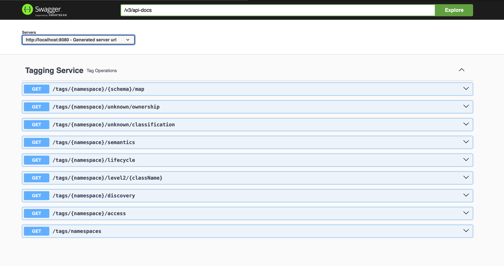

## Tagging APIs

The APIs follow the dot notation tagging convention:

```
GET /tags/acme.customer/semantics
```

The underlying RDF ontology models the concepts:

```
acme:Semantics a rdf:Class .
acme:CustomerInfo a rdf:Class; 
                  rdf:type acme:Semantics.
```

This enables the api to return the matching tags:

```
[
  "acme.customer.CustomerInfo"
]
```

Additional examples for other tag types:

```
# RDF Ontology
acme:Access a rdf:Class .  
acme:Public a rdf:Class;
             rdf:type acme:Access.
             
# API Call            
GET /tags/acme.data/access

# Response Tags 
[
  "acme.data.Public"
]
```

And lifecycle tags:

``` 
# RDF Ontology
acme:Retention a rdf:Class;
                rdf:type acme:DataLifecycle.
                
# API Call                  
GET /tags/acme.order/lifecycle  

# Response Tags
[
  "acme.order.Retention"  
]
```

The tagging REST APIs could enable this as:

Endpoint | Description | Example Response
--- | --- | ---
GET /tags/namespaces | Get all namespaces | ["acme"]
GET /tags/acme/semantics | Get semantic tags | ["acme.customer", "acme.product"]  
GET /tags/acme/customer | Get all customer tags | ["acme.customer.PII", "acme.customer.profile"]
GET /tags/acme/product | Get all product tags | ["acme.product.inventory", "acme.product.pricing"]

## Exposing Taxonomy via APIs

| API | Description | Sample Output |
|-|-|-|
| `GET /tags/namespaces` | Get defined namespaces | `["tagify"]` |
| `GET /tags/tagify/level1` | Get level 1 branches | `["tagify:Classification", "tagify:Access"]` |  
| `GET /tags/tagify/Classification/level2` | Get level 2 groups under Classification | `["tagify:Sensitivity", "tagify:Criticality"]` |
| `GET /tags/tagify/Sensitivity/level3` | Get level 3 categories under Sensitivity | `["tagify:Confidential", "tagify:Private"]`  |
| `GET /assets/customers/tags` | Get tags for customer asset | `["tagify:Confidential", "tagify:EU"]` |

And the taxonomy alignment would look like:

```
tagify:Classification
  tagify:Sensitivity
    tagify:Confidential

GET /tags/tagify/Sensitivity/level3 -> ["tagify:Confidential"]

GET /assets/customers/tags -> ["tagify:Confidential"]
```

Here is an example showcasing Gem Retail Company's use of Tagify RDF and taxonomy standards:

## Example: Gem Retail Tagging Standards

Gem Retail has adopted Tagify standards for developing its customer focused enterprise ontology.

The core namespace is defined as:

```
@prefix gem: <https://data.gemretail.com/> .
```

**Top-level Branches**

The main top branches represent broad classification types:

```
gem:Classification
gem:Interaction
gem:Access
```

**Level 2 Classes**

Captures domain specific groups under the branches suited for Gem:

``` 
gem:Classification
gem:Customer
gem:Product

gem:Access  
gem:Permission
gem:PII
```  

**Level 3 Categories**

Adds depth with specialized sub-types:

```
gem:Customer
gem:Profile
gem:Contact

gem:PII
gem:Finance
gem:Health
```

**Sample Tag**

Classifying customer profile data as confidential PII:

```
gem:ConfidentialProfileData a rdf:Class;
rdf:type gem:Profile, gem:PII;
```

**Using Tags**

Apps apply tags to data assets:

```
CREATE TABLE customers (
id INT TAG gem:identifies
name STRING TAG gem:ConfidentialProfileData
)
```

This demonstrates applying Tagify guidelines to define standards meeting Gem Retail's business goals. The consistent ontology and tagging drives data governance and security.

Gem Retail implements Tagify standards for a consistent customer data taxonomy enabling unified governance.

### OAS UI

